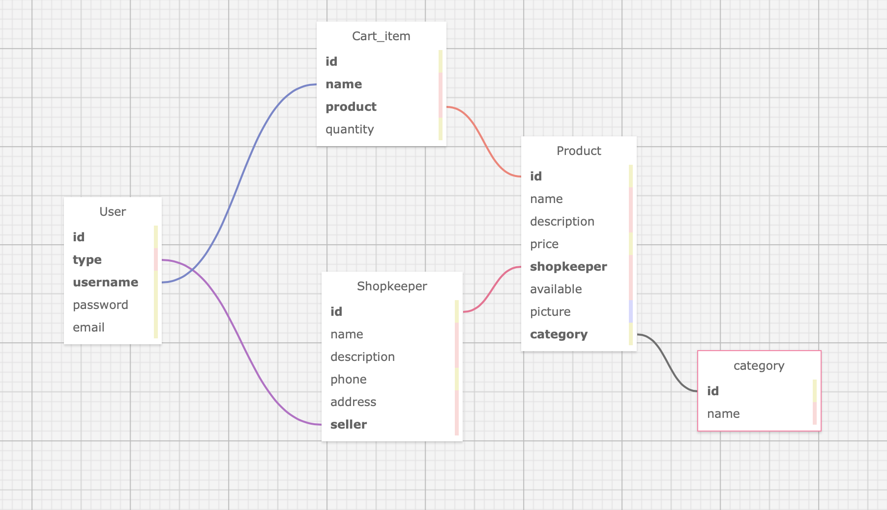

# Site de Click&Collect "La Confinerie"

## Description générale : 
Ce site a pour objectif de répondre à l’appel à projets du Ministère de l’économie (https://www.entreprises.gouv.fr/fr/aap/commerce-et-artisanat/appel-projets-pour-renforcer-la-digitalisation-du-commerce-de-proximite) : dans un contexte de crise sanitaire, le gouvernement souhaite "mettre à disposition des TPE/PME des outils numériques susceptibles de les aider dans le maintien de leur activité et les appuyer dans leur adoption à des conditions préférentielles". 
Ce projet est un site de Click&Collect qui serait mis à la disposition de commerçants. 
Les commerçants peuvent s'y inscrire en créant un compte Vendeur. Avec ce compte, ils peuvent enregistrer leurs produits, les mettre dans des catégories et ajouter des catégories. Les clients peuvent choisir des articles et constituer leur panier,en ayant à leur disposition de nombreuses informations telles que le nom du vendeur, le prix,une description, une photo...

## Auteurs : 
Clément Lavenu  
Thomas Perrein   
Mathieu Haon  
Paul Le Bolloch  
Marc Pouyanne   
Antoine Rapinat   

## Description détaillée
### Struture globale du projet
Le projet est découpé en plusieurs répertoires :  
       * la_confinerie (Répertoire principal)     
       * homepage (Application correspondant à la page d'accueil)   
       * login (Application correspondant au sysètme d'authentification)   
       * store (Application servant de boutique)   
       * media (Répertoire contenant les images des produits)  
### Architecture visuelle
#### Du point de vue de l'utilisateur 

Le site offre une interface simple à l'utilisateur. 

**Barre des menus** 
Les liens dont il a besoin sont tous regroupés dans la barre des menus en haut de page.

 Afin de simplifier au maximum l'interface pour l'utilisateur, les liens affichés changent en fonction du compte connecté. 
 + Si aucun compte n'est connecté, sont affichés les liens vers les pages d'inscription et de connexion
 + Si un compte est connecté, un onglet "Profile" est affiché
 + Si le compte connecté est un compte vendeur, unonglet supplémentaire "Ajouter un produit" est affiché
 + Les onglets "La confinerie", store et la barre de recherche sont toujours affichés.
 + L'onglet "La confinerie" permet de revenir à la page d'accueil

**Administration**
Les pages de changement ou réinitialisation de mot de passe s'ouvrent dans un nouvel onglet avec l'interface d'administration de django. Une fois les changements effectués, il ne vous reste plus qu'à fermer la page ouverte et profiter de votre site de Click&Collect.

Afin de prévenir de champs mal renseignés, l'enregistrement est annulé. Par exemple lors de l'inscription d'un utilisateur, le numéro de téléphone doit commencer absoluement par *+33* et avoir le nombre de chiffres correspondant au format téléphonique français.


**Navigation**

Pour ne pas noyer l'utilisateur, les produits sont affichés sur plusieurs pages.

#### Structure des fichiers de l'architecture visuelle
Le répertoire avec les fichiers static est situé dans l'application *homepage*. 
Les applications **homepage*, *store* et *login* contiennent toutes un dossier templates. Chacun de ces trois dossiers contient un fichier *base.html* propre à chaque application. Les autres fichiers html d'une même application font référence au fichier *base.html* de la même application.

### Base de données

La base de données est située dans le fichier models.py de l'application store. Elle utilise l'ORM Django. Voici sa structure, dressée à l'aide de [SQL Desginer](https://ondras.zarovi.cz/sql/demo/)



La table *Cart_item* sert à constituer le panier. L'attribut *name* de panier **n'est pas** unique et ne lui sert pas identifiants. Les instances de la table *Cart_items* doivent être vues commes les sous-commandes d'une commande. Les sous-commandes d'une même commande portent le même nom. Le code est construit de telle façon que lorsqu'un objet est crée dans *Cart_item*, son nom est celui de l'utilisateur qui l'a créé. Ainsi, lorsque le panier de l'utilisateur s'affiche, il affiche en réalité toutes les instance de *Cart_items* portant le nom de l'utilisateur. Cette organisation a permis de grandement simplifier la gestion des paniers. L'utilisateur ne peut constituer qu'un seul panier à la fois. 
*Une fois qu'il aura confirmé son panier, ce dernier sera vidé. La confirmation du panier n'est pas inclue dans le MVP. Un bouton vous invitant à confirmer votre panier est disponible, mais il n'a aucun impact sur votre panier dans le MVP*

 **Quelques points d'attention particuliers :**
Sur cette représentation, il n'est pas aisé de distinguer les types de relation ( one-to-one, many-to-many, etc...). 
L'ORM Django offre une certaine flexibilité en ce qui concerne la création des tables et la manipulation des requêtes. La représentation par SQL Designer founie risque d'induire en erreur la compréhension de la structure base de données.
 + La table User() recense les comptes utilisateurs. Néanmoins, l'ORM DJango permet de différencier les utilisateurs (Vendeur, Client) en ajoutant de nouvelles propriétés et en créant de nouvelles classes (dans l'application login). Ainsi, l'attribut *type* de *User()* ne renvoie pas toujours à une instance de *Shopkeeper*.  
 + Le système d'authentification propre à Django a été utilisée pour mettre en place les permissions et les différents comptes User(). Pour éviter des problèmes relationnels, l'attribut *name* de *Cart_item* n'est pas relié explicitement à l'username par une relation dans la base de données.


### Bibliothèques importées

Pour lancer correctement le serveur du site, il faut installer la libraire [django-phonenumber-field](https://github.com/stefanfoulis/django-phonenumber-field) avec la commande : 

```bash
pip install django-phonenumber-field[phonenumbers]
  ```


ou 

```bash
pip3 install django-phonenumber-field[phonenumbers] 
```
### Stabilité du site

(Possibilité de mettre des tags)
Les fichiers *test.py* de chaque application permettent de vérifier que les urls mènent aux bonnes vues, et que les vues renvoient des pages html correctes. 
Le module utilisé ici pour faire les tests est le module [unittest](https://docs.python.org/3/library/unittest.html).


# Développement du projet
## Analyse

## Conception

## Découpage du travail
Nous n'avons malheureusement pas eu le temps d'appliquer toutes nos idées. Les objectifs non réalisés portent la mention *(non fait)* en bout de ligne.


**Sprint 0 :** 

 + Socle technique installé  
 + Analyse des besoins   
 + Réflexion autour de la conception

 


### Objectif 1 : Mettre en place un socle de travail commun 

**Sprint 1** : Initialisation du projet 

 + Création du projet Django   
 + Création d’une app dédiée pour la page d’accueil (homepage)   
 + Création d’une app store 

**Sprint 2** : Architecture des données 

 + Schéma pour la base de données à l’aide de SQLDesigner   
 + Créer la base de données  
     + Mettre les informations simples et essentielles (nom, vendeur, prix)
     + Ajouter les autres informations textuelles (Catégorie, description)
     + Ajouter une photo au produit
 + Expérimentation dans le shell   
Ajout d’un lot de données pour tester le site   

**Sprint 3** : Vérifier la stabilité de note site (Lors des sprints suivants, le sprint 3 est impliqué implicitement)    

 + Ecriture des tests pour les redirections, pour  
    + Homepage
    + Store
    + Login
    + Contact

 + Ecriture des tests pour les vues, pour  
    + Homepage
    + Store      
    + Login
    + Contact

 + Test de couverture (Atteindre au moins 80%)


 

### Objectif 2 : Concevoir le store 

**Sprint 4** : Rechercher et trouver des produits   
 
 + Création d'une barre de recherche   
 + Transmission de requête par l’url et création des vues   
 + Indiquer si rien ne correspond au produit cherché  


**Sprint 5** : Donner des informations sur les produits   

 + Afficher les informations essentielles (Nom, vendeur)  
 + Afficher les autres informations textuelles (ne faisant pas appel à des clefs étrangères)  
 + Afficher la catégorie  
 + Afficher la photo  


**Sprint 6** : Ajouter des produits à la base de données   

 + Formulaire d’ajout de produit
    * Sauvegarder les informations élémentaires (nom, shopkeeper, price)
    * Sauvegarder la disponibilité
    * Sauvegarder la catégorie
    * Sauvegarder l'image

+ Page de confirmation d'ajout
+ Afficher les informations enregistrées sur la page de confirmation
    + Afficher les informations essentielles
    + Afficher la disponibilité
    + Afficher la catégorie
    + Afficher l'image

 + Pouvoir créer une catégorie
    + Formulaire d'ajout
    + Page de confirmation
 + Navigation ente les pages
    + Lien depuis la page 'Ajout produit' menant à la page 'Ajout de catégorie'
    + Lien depuis la page confirmation 'Catégorie ajoutée' vers la page 'ajout produit'
    + Lier le produit ajouté au compte commerçant connecté    


**Sprint 7** : Création d’un panier   

+ Création des vues     
+ Relier le panier affiché à l’utilisateur     
+ Pouvoir ajouter un produit au panier depuis sa fiche détail
 

### Objectif 3 : Administrer la plateforme 

**Sprint 8** : Enregistrement de l’utilisateur    

 + Création d’un compte utilisateur basée sur le cours OpenClassroom   

**Sprint 9** : Utilisation des outils d'authentification de django   

+ Création du formulaire d’inscription   
+ Page de connexion   
+ Page de déconnexion   
+ Pouvoir changer le mot de passe   
+ Réinitialisation du mot de passe   
+ Créer les permissions et les groupes
+ Attribuerles permissions aux groupes

**Sprint 10** : Fusionner les deux modes   d’authentification     


 

### Objectif 4 : Concevoir l’architecture visuelle 

**Sprint 11** :  Design de la page de premier contact avec l’utilisateur   

+ Choix du design   
+ Téléchargement d’un modèle opensource   
+ Installation pour homepage   
+ Mettre dans la barre des menus les onglets
    + Lien vers le store
    + Incorporation de la barre de recherche
    + Lien vers : s'incrire, se connecter, se déconnecter
    + Changer les onglets affichés si un compte est connecté ou non 

**Sprint 12** Mettre en place le visuel des autres applications et pages   

+ Utilisation de la base commune visuelle (sprint 11)     
+ Extension des gabarits  
   

 

### Objectif 5 : Favoriser la communication entre les parties prenantes  (Non fait)

**Sprint 13** :  Permettre aux utilisateurs de communiquer avec les producteurs 

 + Mise en place d’un formulaire de contact   
 + Envoi du message   
 + Confirmation d’envoi du message à l’utilisateur   

**Sprint 14** : Noter les commerçants 

 + Mettre à jour la base de données : ajout d’un champ dans la table Shopkeeper  
 + Ajout d’une table avec les notes   

 

### Objectif 6 : Ajouter des fonctions plus utiles et pointues 

 **Sprint 15** : Préciser la base de données : ajouter les secteurs (Alimentaire, Vetements) 

 + Mettre à jour la base de données : créer les objets dans models  
 + Relier les category aux sectors  
 + Créer une table 'numéros de téléphone'

**Sprint 16** : Perfectionner la recherche

 + Faire apparaître les résultats sous frome d'une liste
 + Afficher des informations supplémantires sur les produits
 + Afficher les photos des produits
 + Elargirla recherche en prenant en compte le nom du vendeur
 + Améliorer le visuel 

 **Sprint 17** Offrir plus de flexibilité 

 + Pouvoir afficher des produits sans image
 + Pouvoir ajouter des produits sans image


### Objectif 7 : Livrer un MVP
Tests unitaires  
Tests fonctionnels
 

 ### Encore plein d'autres idées...

 Notre découpage se termine par l'objectif 7. Nous aurions adoré avoir plus de temps pour mettre en place nos autres idées : réservation de créneaux de récupération des produits, envoi des confirmations de paniers aux vendeurs par mail, itinéraire entre les commerces proposé par Google maps, schéma de réservation des créaneaux calculé par le site afin de de diminuer le temps passé en dehors de chez soi...
